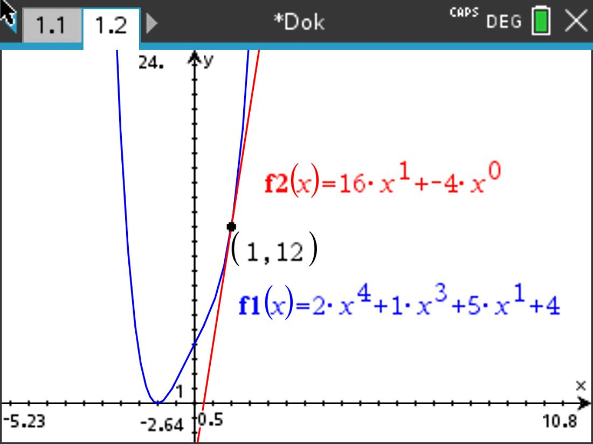

## simple tanget calculator for polynomial functions
This project is a very bare bones solution for getting a tanget or a derivative of an already simplified polynomial function.
Since this is nothing too advanced you will not be able to enter anything else than doubles.

Apologies for entirely writing the programm in german.

### Input

The programm will not prompt you to enter the whole function but will ask you to enter the highest exponent of the function.
```
Grad der Funktion: 4
```
This enables the application to ask for an array of doubles that represent the coefficients from a_n to a_0 here represented with 2, 1, 0, 5 and 4.
```
x^4 * 2
x^3 * 1
x^2 * 0
x^1 * 5
x^0 * 4
```
The example mentioned above would result in this function `f(x)=2x^4 + 1x^3 + 0x^2 + 5x^1 + 4x^0` or simplyfied `f(x)=2x^4 + x^3 + 5x + 4` 
and the derivative `f'(x)=8x^3 + 3x^2 + 0x^1 + 5x^0` or simplified `f'(x)=8x^3 + 3x^2 + 5`.

The only thing left to to is to enter the position of the tangent, so that the tanget can be calculated.
```
Gib die Stelle, durch die die Tangente verlaufen soll, an: 1

t(x)=16x^1 + -4x^0
```



### But why?

Well... you might think that every calculator has this functionality built in and ask yourself: why did you this?
There is an simple answer: Back in the day I didn't know that the TI-nspire cx without cas (the calculator I currently own) could solve this problem
and wanted to at least be able to check my solutions. Well I guess know its wasted time xD.